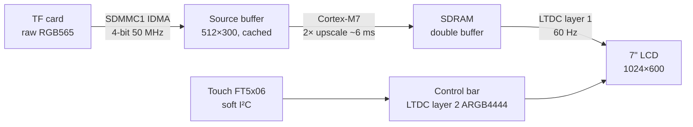

# STM32H743 SD-Card Video Player — 30 fps on a 7" 1024×600 Touch Display

Bare-metal full-screen video playback on an **STM32H743** microcontroller — no Linux, no RTOS, no GPU.
Raw RGB565 frames stream from a TF card, are upscaled 2× by the Cortex-M7 into a 32 MB SDRAM
double buffer, and are scanned out by the LTDC at 60 Hz. A touch control bar (play/pause, live-scrub
seek) is alpha-blended on a second LTDC layer.

<!-- Add a demo GIF or video link here -->
<!--  -->

| | |
|---|---|
| **Resolution** | 1024×600 full screen (512×300 source, 2× nearest-neighbour) |
| **Frame rate** | 30 fps sustained (measured), ~60 fps ceiling |
| **Refresh** | 60.0 Hz, page flip at VBlank — no tearing |
| **UI** | Capacitive touch: play/pause, seek bar with live preview, auto-hide |
| **Build** | STM32CubeIDE, HAL v1.11.5, FatFs R0.15 — 0 errors, 0 warnings |

---

## Hardware

| Part | Details |
|---|---|
| MCU board | STM32H743XIH6 Core Board V1.1 (Cortex-M7, 2 MB flash, 1 MB RAM) |
| SDRAM | IS42S32800J-7BLI, 32 MB, 32-bit, FMC bank 2 @ `0xD0000000` |
| Display | 7" IPS 1024×600 RGB, EK79001 driver, Alientek-compatible 40-pin FPC (LCD1) |
| Touch | FT5x06 family (FT5206/FT5426/FT5446) or GT911 — auto-detected |
| Storage | TF card on SDMMC1, 4-bit, 50 MHz High Speed |
| Console | USART1 via CH340X USB-C "COM" port, 115200 8N1 |

---

## How it works



**Frame pipeline** — frame period = `max(SD read, upscale)` instead of their sum:

```
SD IDMA : |--- read N+1 → src[B] ---|--- read N+2 → src[A] ---|
CPU     : |- upscale N -|  wait    |- upscale N+1 -|  wait    |
LTDC    :        flip N @ VBlank        flip N+1 @ VBlank
```

### Key techniques

| Technique | Why it matters |
|---|---|
| **Raw LBA reads** — FatFs fast-seek builds the file's cluster map once; frames are then read as contiguous sector ranges with async SDMMC internal DMA | FatFs normally splits reads at every cluster boundary (up to 75 SD commands per frame on small-cluster cards); now 1 command per frame |
| **Double-buffered source** — next frame is fetched in the background while the current one is upscaled | Overlaps SD transfer with CPU work |
| **Row-sequential SDRAM writes** — each output line is built in a cached AXI line buffer, then written to both destination rows one after the other | A 1024-px RGB565 line is exactly one 2 KB SDRAM row; interleaving rows caused a precharge + activate on nearly every store |
| **Cache policy via MPU** — I+D cache on; frame buffers non-cacheable; second source window write-through cacheable; IDMA buffers invalidated before/after transfer | LTDC always sees CPU writes; CPU never reads stale DMA data |
| **Hot loops forced `-O3`** | Debug (`-O0`) builds run at full speed |
| **Non-blocking page flip** at VBlank | No tearing, no CPU stall waiting for refresh |
| **Pixel clock 51.2 MHz** (1344×635 total) | Exactly 60.0 Hz → 30 fps = 2 refreshes per frame, no judder |

### Optimisation history

| Version | fps | Bottleneck |
|---|---|---|
| Sequential read → upscale, D-cache off, `-O0` | 20 | Upscale ~30 ms, blocking VBlank wait |
| Async prefetch, 2nd buffer in uncached SDRAM | 18 | SDRAM row thrashing on alternate frames |
| D-cache + MPU + row-sequential writes + forced `-O3` | **30** | Content frame rate (ceiling ~60) |

---

## Memory map

| Region | Address | Size | Cache | Use |
|---|---|---|---|---|
| Flash | `0x08000000` | ~70 KB | — | Code |
| AXI SRAM | `0x24000000` | 512 KB | WB | `.data/.bss`, stack, source buffer A (300 KB) |
| SDRAM FB0 | `0xD0000000` | 2 MB | Non-cacheable | Frame buffer 0 |
| SDRAM FB1 | `0xD0200000` | 2 MB | Non-cacheable | Frame buffer 1 |
| SDRAM UI | `0xD0400000` | 160 KB | Non-cacheable | Control bar (ARGB4444) |
| SDRAM SRC1 | `0xD0600000` | 512 KB | Write-through | Source buffer B |

## Clocks

| Clock | Frequency |
|---|---|
| SYSCLK (HSE 25 MHz → PLL1) | 400 MHz (VOS1) |
| HCLK / APBx | 200 / 100 MHz |
| SDMMC1 kernel (PLL1Q) → SD_CK | 200 MHz → 50 MHz |
| FMC → SDCLK | 200 MHz → 100 MHz, CL3 |
| LTDC pixel clock (PLL3R) | 51.2 MHz → 60.0 Hz |

## Pin usage

| Function | Pins |
|---|---|
| LTDC RGB888 | PI12–PI15, PJ0–PJ15, PK0–PK7 (AF14) |
| FMC SDRAM | PC0, PD0/1/8–10/14/15, PE0/1/7–15, PF0–5/11–15, PG0/1/4/5/8/15, PH6–15, PI0–7/9/10 (AF12) |
| SDMMC1 | PC8–PC12, PD2 (AF12) |
| Touch | PB10 SCL, PB11 SDA (soft I²C), PB12 RST, PB5 INT |
| LCD | PB0 backlight, PH5 reset |
| USART1 | PA9 TX, PA10 RX |
| LEDs | PA3 green, PB1 blue (active low) |

---

## Getting started

### 1. Build and flash
1. Clone and import into STM32CubeIDE: *File → Import → Existing Projects into Workspace*.
2. Build (Debug or Release). Release recommended.
3. Flash via SWD (ST-Link / DAP-Link).

> ⚠️ **Do not regenerate code from `STM32H7.ioc`.** The `.ioc` does not describe the peripheral
> configuration; "Generate Code" would overwrite clocks, MPU, MSP and `hal_conf.h`.

### 2. Convert a video

```bash
ffmpeg -i input.mp4 -an \
  -vf "scale=512:300:force_original_aspect_ratio=increase:flags=lanczos,crop=512:300,fps=30" \
  -pix_fmt rgb565le -f rawvideo VIDEO.BIN
```

- Output: raw RGB565 little-endian, no header, 307,200 bytes per frame (= 600 sectors).
- Parameters must match `VIDEO_W`, `VIDEO_H`, `VIDEO_FPS`, `VIDEO_SCALE` in `main.c`.
- Letterbox instead of crop: `force_original_aspect_ratio=decrease,pad=512:300:(ow-iw)/2:(oh-ih)/2`.

### 3. Prepare the SD card
1. Format FAT32 (≤32 GB, 64 KB allocation unit) or exFAT (>32 GB, ≥128 KB).
2. Copy `VIDEO.BIN` to the root **first** so it is stored contiguously.
3. Insert into the TF slot on the bottom of the core board and reset.

### 4. Check the console (115200 8N1)

```
=== H743 SD video player ===
Build: optimised, I+D cache on
SDRAM OK
SD: high speed, 50 MHz
Touch: FocalTech FT5x06 family, chip id 0x54
Playing VIDEO.BIN: 512x300 x2 -> 1024x600, 694 frames @ 30 fps
Cluster 64 KB, 1 fragment(s): raw async IDMA path
fps 30 | SD wait 0 ms | upscale 6 ms
```

---

## Touch controls

| Gesture | Action |
|---|---|
| Tap video | Show / hide control bar |
| Tap left button | Play / pause |
| Tap or drag seek bar | Live preview while dragging, seek on release |
| No touch for 3 s | Bar auto-hides (stays while paused) |

Orientation is set per controller in `touch.h` (`TOUCH_FT_SWAP_XY`, `TOUCH_*_INVERT_X/Y`).
Set `TOUCH_DEBUG 1` to print raw coordinates.

---

## Configuration

| Macro | File | Default | Notes |
|---|---|---|---|
| `VIDEO_FILE` | `main.c` | `"VIDEO.BIN"` | Root of the SD card |
| `VIDEO_W` / `VIDEO_H` | `main.c` | 512 / 300 | Source frame size |
| `VIDEO_FPS` | `main.c` | 30 | Must match the conversion |
| `VIDEO_SCALE` | `main.c` | 2 | `1` = native (e.g. 1024×600 raw, ~16 fps) |
| `SHOW_COLOR_BARS` | `main.c` | 0 | 2 s LTDC test pattern at boot |
| `FMC_SDRAM_RPIPE_DELAY_1` | `main.c` | 1 | Try 0/2 if the SDRAM test fails |
| `TOUCH_DEBUG` | `touch.h` | 0 | Print touch coordinates |

---

## Project structure

```
Core/
├── Src/
│   ├── main.c              clocks, MPU, cache, FMC/LTDC/USART init, app entry
│   ├── video_player.c      pipeline, upscale, pacing, touch state machine
│   ├── sd_diskio.c         FatFs disk I/O + async raw LBA job API (SDMMC1 IDMA)
│   ├── touch.c             FT5x06 / GT911 driver, bit-banged I²C
│   ├── ui.c                control bar renderer (LTDC layer 2, ARGB4444)
│   ├── sdram.c             IS42S32800J JEDEC init + memory test
│   ├── stm32h7xx_hal_msp.c pin muxing (LTDC, FMC, SDMMC1, USART1)
│   ├── stm32h7xx_it.c      LTDC / SDMMC1 IRQ handlers
│   └── FatFs/              FatFs R0.15 (read-only, LFN, exFAT, fast seek)
└── Inc/                    headers, ffconf.h, stm32h7xx_hal_conf.h
Drivers/                    STM32H7xx HAL v1.11.5, CMSIS
```

---

## Troubleshooting

| Console / symptom | Fix |
|---|---|
| `SDRAM FAIL at word N` | Change `ReadPipeDelay` (0/1/2) in `MX_FMC_Init` |
| `f_mount failed: 13` | Card not FAT32/exFAT — reformat |
| `f_open(VIDEO.BIN) failed: 4` | File missing or not in root |
| `FatFs path (reformat + copy to defragment)` | File fragmented — reformat, copy `VIDEO.BIN` first |
| `SD: default speed, 25 MHz` | Card does not support High Speed — use Class 10 / U1 or better |
| `SD wait` > 5 ms | Card too slow for the target fps |
| Taps in the wrong place | Adjust swap/invert macros in `touch.h` |
| Board stays in bootloader on COM power | CH340X DTR is wired to BOOT0 — enable DTR in the terminal, or run via SWD |

---

## Roadmap

- [ ] MJPEG + hardware JPEG codec + DMA2D YCbCr→RGB for native 1024×600 at 30–60 fps
- [ ] Playlist / file browser on the touch UI
- [ ] 60 fps content
- [ ] Audio via I²S codec

---

## Notes

- The core board uses an STM32H743**XI** (2 MB); the CubeIDE project targets **XG** (1 MB) — works unchanged, the image is ~70 KB.
- Video files are **not** included in the repository (GitHub limits files to 100 MB). Use your own or Creative Commons footage (e.g. *Big Buck Bunny*).

## License

Application code: MIT — see [LICENSE](LICENSE).
Third-party components keep their own licenses: STM32H7 HAL / CMSIS (BSD-3-Clause, STMicroelectronics),
FatFs (FatFs license, ChaN).

## Author

**Muhammad Usman** — embedded hardware & firmware engineer
Instagram: [@embeddedwithmeer](https://www.instagram.com/embeddedwithmeer)
